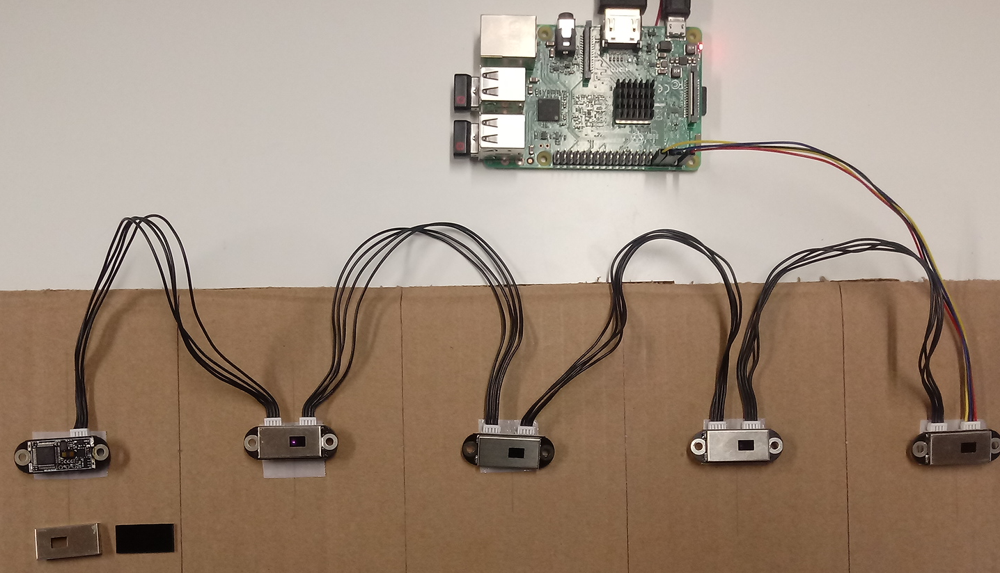
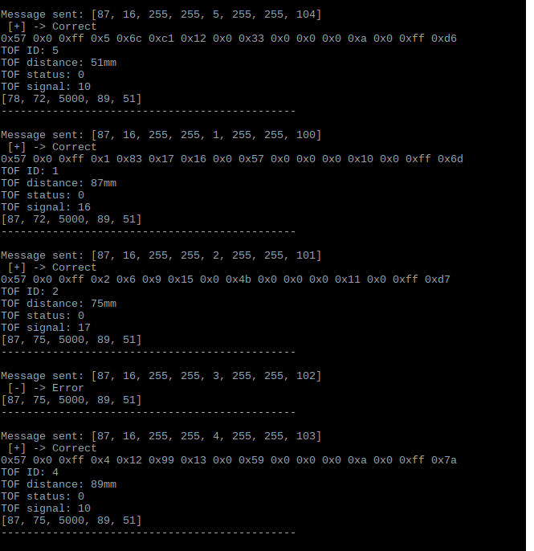

# TOF Laser Range Sensor (PSS552 pcb)

 TOF Time Of Flight Sensors in UART cascade mode with 5 sensors chained.

 Short Range Distance: 12mm to 2.16m 
 
 Accuracy: +- 1cm, Resolution: 1mm  
  
 Wavelwngth: 940nm (Class1 standard compliant), FOV 15 ~27°
 
 Communication interface: UART 3.3V TTL
 
 Cascade support: UART up to 8 sensors
 
 Power consumption: 290mW, 5V, 58mA
 

## Experiment

## Program output 

## License

[DRINKOTEC](https://drinkotec.ch/)
